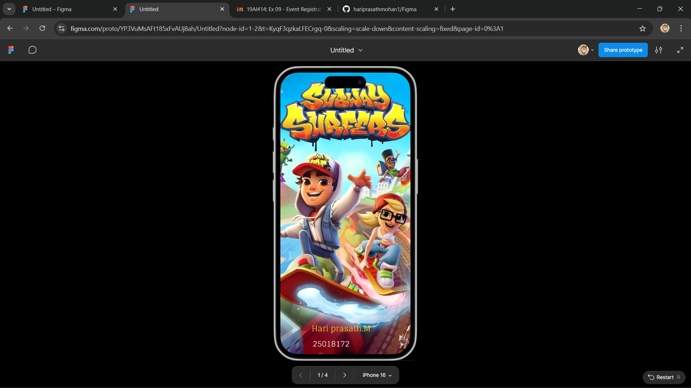
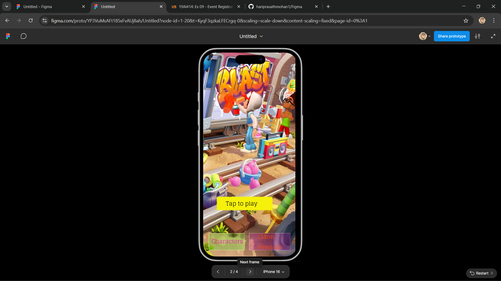
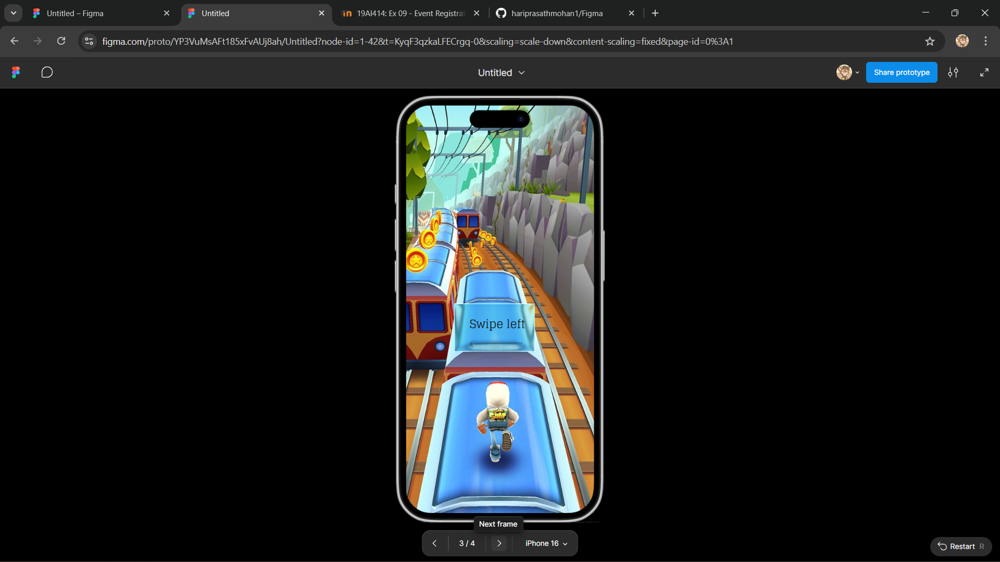
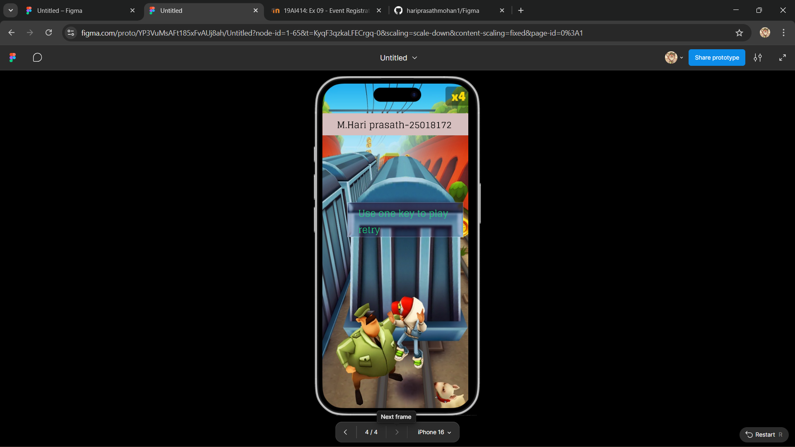

# Ex08 Event Registration Web Application
## Date:20.03.2026

## AIM:
To design, develop and deploy a web application for event registration using Figma UI tool.

## UI DESIGN TOOL:
Figma

## DESIGN STEPS:

### Step 1:
Use frames to represent screens or sections.

### Step 2:
Add column grids for consistent spacing and alignment.

### Step 3:
Insert shapes, text, buttons, and icons.

### Step 4:
Use Auto Layout for flexible, responsive design.

### Step 5:
Define color, text, and effect styles globally for consistency.

### Step 6:
Name layers logically and group related elements.

### Step 6:
Link frames to show navigation or interactions.

### Step 7:
Select the specific frame while generating code using Anima plugin.

## CODE:
```
Home page:1

<!DOCTYPE html>
<html>
  <head>
    <meta name="viewport" content="width=device-width, initial-scale=1" />
    <meta charset="utf-8" />
    <link rel="stylesheet" href="globals.css" />
    <link rel="stylesheet" href="style.css" />
  </head>
  <body>
    <div class="iphone">
      
      <div class="rectangle"></div>
      
      <div class="frame"><div class="text-wrapper">Hari prasath.M</div></div>
      <div class="div">25018172</div>
    </div>
  </body>
</html>

style.css1

.iphone {
  background-color: #730c80;
  overflow: hidden;
  width: 100%;
  min-width: 393px;
  min-height: 852px;
  position: relative;
}

.iphone .official-homepage {
  position: absolute;
  top: 0;
  left: 0;
  width: 393px;
  height: 852px;
  aspect-ratio: 0.59;
  object-fit: cover;
}

.iphone .rectangle {
  position: absolute;
  top: 713px;
  left: 52px;
  width: 5px;
  height: 3px;
  background-color: #d9d9d9;
}

.iphone .text-on-a-path {
  position: absolute;
  top: 818px;
  left: 730px;
  width: 241px;
  height: 46px;
}

.iphone .frame {
  position: absolute;
  top: 740px;
  left: 13px;
  width: 294px;
  height: 47px;
  display: flex;
  overflow: hidden;
}

.iphone .text-wrapper {
  margin-top: 12px;
  width: 178px;
  height: 43px;
  margin-left: 82px;
  font-family: "Glegoo-Regular", Helvetica;
  font-weight: 400;
  color: #ffd711;
  font-size: 24px;
  letter-spacing: 0;
  line-height: normal;
}

.iphone .div {
  position: absolute;
  top: 798px;
  left: 98px;
  width: 175px;
  font-family: "Glegoo-Regular", Helvetica;
  font-weight: 400;
  color: #ffffff;
  font-size: 24px;
  letter-spacing: 0;
  line-height: normal;
}

page 2:

<!DOCTYPE html>
<html>
  <head>
    <meta name="viewport" content="width=device-width, initial-scale=1" />
    <meta charset="utf-8" />
    <link rel="stylesheet" href="globals.css" />
    <link rel="stylesheet" href="style.css" />
  </head>
  <body>
    <div class="iphone-plus">
      
      
      <div class="text-wrapper">Tap to play</div>
      <div class="div"></div>
      <div class="text-wrapper-2">Characters</div>
      <div class="rectangle-2"></div>
      <div class="text-wrapper-3">Claim Rewards</div>
    </div>
  </body>
</html>

style.css2:

.iphone-plus {
  background-color: #ffffff;
  width: 100%;
  min-width: 384px;
  min-height: 852px;
  position: relative;
}

.iphone-plus .download {
  position: absolute;
  top: 0;
  left: 0;
  width: 384px;
  height: 852px;
  aspect-ratio: 0.45;
  object-fit: cover;
}

.iphone-plus .rectangle {
  position: absolute;
  top: 598px;
  left: 53px;
  width: 240px;
  height: 64px;
}

.iphone-plus .text-wrapper {
  position: absolute;
  top: 609px;
  left: 95px;
  width: 194px;
  font-family: "Glegoo-Regular", Helvetica;
  font-weight: 400;
  color: #000000;
  font-size: 24px;
  letter-spacing: 0;
  line-height: normal;
}

.iphone-plus .div {
  position: absolute;
  top: 754px;
  left: 24px;
  width: 149px;
  height: 71px;
  background-color: #12f20b33;
  backdrop-filter: blur(2.0px) brightness(100.0%) saturate(100.0%);
  -webkit-backdrop-filter: blur(2.0px) brightness(100.0%) saturate(100.0%);
  box-shadow:
    inset 0 1px 0 rgba(255, 255, 255, 0.4), inset 1px 0 0 rgba(
      255,
      255,
      255,
      0.32
    ), inset 0 -1px 1px rgba(0, 0, 0, 0.13), inset -1px 0 1px rgba(
      0,
      0,
      0,
      0.11
    );
}

.iphone-plus .text-wrapper-2 {
  position: absolute;
  top: 767px;
  left: 35px;
  width: 157px;
  font-family: "Glegoo-Regular", Helvetica;
  font-weight: 400;
  color: #ea12aa;
  font-size: 24px;
  letter-spacing: 0;
  line-height: normal;
}

.iphone-plus .rectangle-2 {
  position: absolute;
  top: 754px;
  left: 192px;
  width: 171px;
  height: 71px;
  background-color: #fe08e133;
  backdrop-filter: blur(2.0px) brightness(100.0%) saturate(100.0%);
  -webkit-backdrop-filter: blur(2.0px) brightness(100.0%) saturate(100.0%);
  box-shadow:
    inset 0 1px 0 rgba(255, 255, 255, 0.4), inset 1px 0 0 rgba(
      255,
      255,
      255,
      0.32
    ), inset 0 -1px 1px rgba(0, 0, 0, 0.13), inset -1px 0 1px rgba(
      0,
      0,
      0,
      0.11
    );
}

.iphone-plus .text-wrapper-3 {
  position: absolute;
  top: 747px;
  left: 227px;
  width: 136px;
  font-family: "Glegoo-Regular", Helvetica;
  font-weight: 400;
  color: #fa4d08;
  font-size: 24px;
  letter-spacing: 0;
  line-height: normal;
}

page 3:

<!DOCTYPE html>
<html>
  <head>
    <meta name="viewport" content="width=device-width, initial-scale=1" />
    <meta charset="utf-8" />
    <link rel="stylesheet" href="globals.css" />
    <link rel="stylesheet" href="style.css" />
  </head>
  <body>
    <div class="iphone-plus">
      
      
      <div class="rectangle"></div>
      <div class="text-wrapper">Swipe left</div>
      
    </div>
  </body>
</html>

style.css

.iphone-plus {
  background-color: #0f0647;
  overflow: hidden;
  border: 1px solid;
  border-color: #000000;
  width: 100%;
  min-width: 405px;
  min-height: 852px;
  position: relative;
}

.iphone-plus .download {
  position: absolute;
  top: 0;
  left: 0;
  width: 405px;
  height: 852px;
  aspect-ratio: 0.56;
  object-fit: cover;
}

.iphone-plus .text-on-a-path {
  position: absolute;
  top: 527px;
  left: -113px;
  width: 167px;
  height: 72px;
}

.iphone-plus .rectangle {
  position: absolute;
  top: 415px;
  left: 102px;
  width: 167px;
  height: 99px;
  background-color: #17c4bb33;
  backdrop-filter: blur(2.0px) brightness(100.0%) saturate(100.0%);
  -webkit-backdrop-filter: blur(2.0px) brightness(100.0%) saturate(100.0%);
  box-shadow:
    inset 0 1px 0 rgba(255, 255, 255, 0.4), inset 1px 0 0 rgba(
      255,
      255,
      255,
      0.32
    ), inset 0 -1px 1px rgba(0, 0, 0, 0.13), inset -1px 0 1px rgba(
      0,
      0,
      0,
      0.11
    );
}

.iphone-plus .text-wrapper {
  position: absolute;
  top: 435px;
  left: 134px;
  width: 135px;
  font-family: "Glegoo-Regular", Helvetica;
  font-weight: 400;
  color: #161212;
  font-size: 24px;
  letter-spacing: 0;
  line-height: normal;
}

.iphone-plus .arrow {
  position: absolute;
  top: 491px;
  left: 133px;
  width: 111px;
  height: 15px;
}


page 4:

<!DOCTYPE html>
<html>
  <head>
    <meta name="viewport" content="width=device-width, initial-scale=1" />
    <meta charset="utf-8" />
    <link rel="stylesheet" href="globals.css" />
    <link rel="stylesheet" href="style.css" />
  </head>
  <body>
    <div class="iphone-plus">
      
      
      <div class="rectangle"></div>
      <p class="text-wrapper">Use one key to play retry</p>
      <div class="div"></div>
      <div class="text-wrapper-2">M.Hari prasath-25018172</div>
    </div>
  </body>
</html>

style.css

.iphone-plus {
  background-color: #ffffff;
  overflow: hidden;
  width: 100%;
  min-width: 383px;
  min-height: 852px;
  position: relative;
}

.iphone-plus .element {
  position: absolute;
  top: 0;
  left: 0;
  width: 383px;
  height: 852px;
  aspect-ratio: 0.75;
  object-fit: cover;
}

.iphone-plus .text-on-a-path {
  position: absolute;
  top: 395px;
  left: -582px;
  width: 291px;
  height: 109px;
}

.iphone-plus .rectangle {
  position: absolute;
  top: 312px;
  left: 66px;
  width: 303px;
  height: 91px;
  background-color: #372b7e33;
  backdrop-filter: blur(2.0px) brightness(100.0%) saturate(100.0%);
  -webkit-backdrop-filter: blur(2.0px) brightness(100.0%) saturate(100.0%);
  box-shadow:
    inset 0 1px 0 rgba(255, 255, 255, 0.4), inset 1px 0 0 rgba(
      255,
      255,
      255,
      0.32
    ), inset 0 -1px 1px rgba(0, 0, 0, 0.13), inset -1px 0 1px rgba(
      0,
      0,
      0,
      0.11
    );
}

.iphone-plus .text-wrapper {
  position: absolute;
  top: 319px;
  left: 94px;
  width: 260px;
  font-family: "Glegoo-Regular", Helvetica;
  font-weight: 400;
  color: #21d87f;
  font-size: 24px;
  letter-spacing: 0;
  line-height: normal;
}

.iphone-plus .div {
  position: absolute;
  top: 78px;
  left: 0;
  width: 383px;
  height: 58px;
  background-color: #d6bfbf;
}

.iphone-plus .text-wrapper-2 {
  position: absolute;
  top: 87px;
  left: 38px;
  width: 331px;
  font-family: "Glegoo-Regular", Helvetica;
  font-weight: 400;
  color: #000000;
  font-size: 24px;
  letter-spacing: 0;
  line-height: normal;
}

```


## OUTPUT:

## RESULT:
The program to design, develop and deploy a web application for event registration using Figma UI tool is completed successfully.
